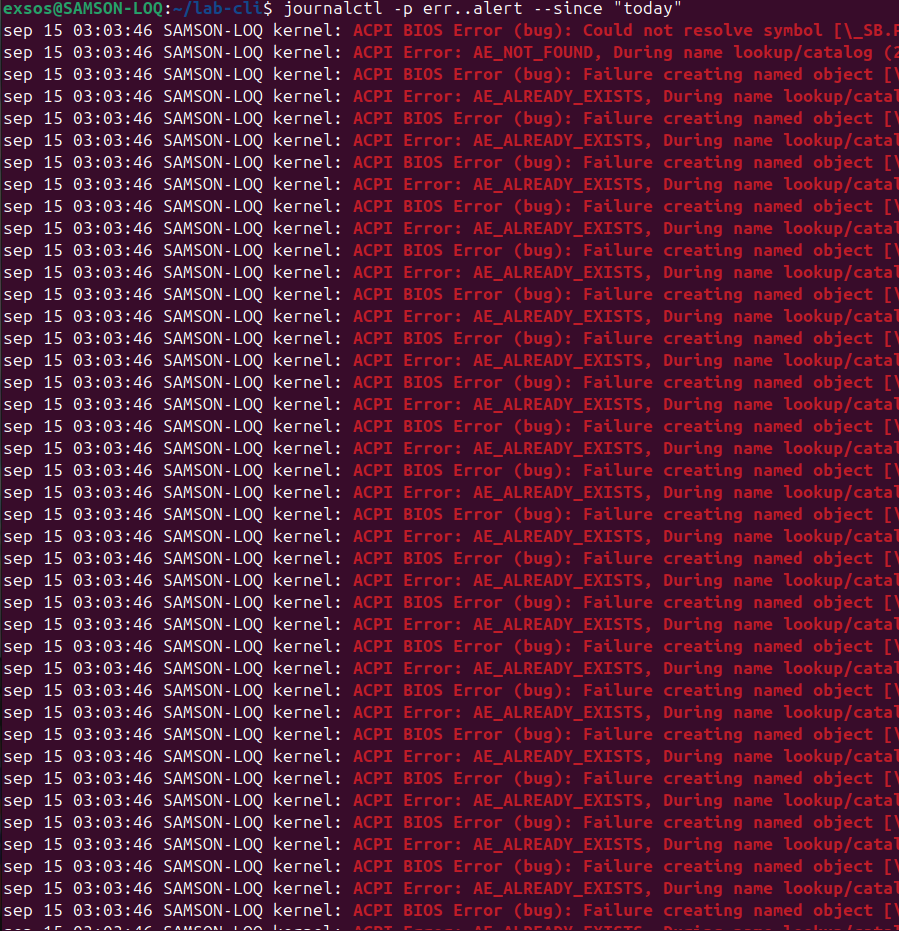
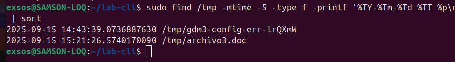
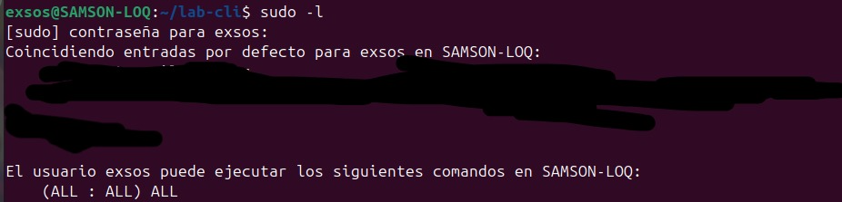
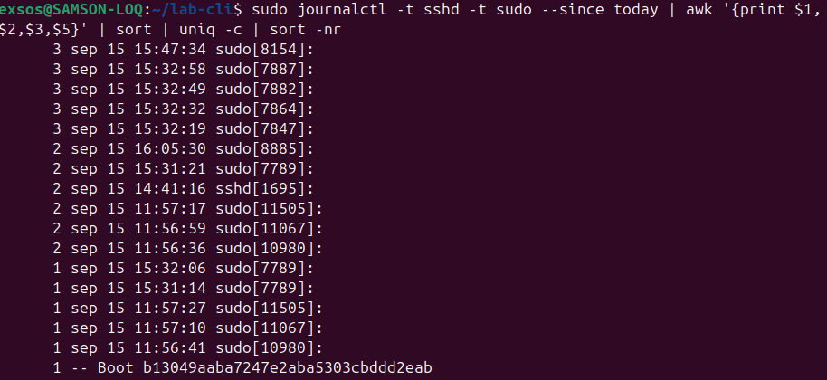

Sección 1:
1. `ls -a`: lista todos los archivos en el directorio, incluso ocultos, `>` escribe la salida en etc_lista.txt
2. `find` encuentra archibos en `/tmp`, maxdepth establece la profundidad maxima de búsqueda a 1 (solo se busca en los archivos del directorio y no en los sub directorios), -type f establece el tipo a archivos, `\( -name '*.txt' -o -name '*.doc' \)` establece que debe ser de tipo .txt o .doc
3. output de `printf` se guarda en `test.txt` via `>`
4. se envia el error via `2>` a `errores.log`, xargs pasa todos los archivos en el directorio con nombre tipo `archivo*.txt` a `rm`, `echo` esta ahi para el dry run

Sección 2:
1. `sudo adduser devsec` añade usuario devsec ,`sudo addgroup ops` crea grupo ops,`sudo usermod -aG ops devsec` añade devsec al grupo ops, `touch secreto.txt` crea archivo `secreto.txt`, en el directorio actual, `sudo chown devsec:ops secreto.txt` cambia el dueño de `secreto.txt` a devsec ,`sudo chmod 640 secreto.txt` permite lectura y escritura total al dueño, solo lectura al grupo, y ni lectura ni escritura ni ejecucion al resto.
2. Gracias al pipeline, se pasa el resultado de `ps aux`, que lista los procesos, a `qrep bash`, que encuentra los procesos del bash
3. `systemctl status systemd-logind` verifica el estado del servicio systemd-logind y `journalctl -u systemd-logind -n 10` ve sus logs, se puede terminar usando su PID Y `kill -SIGTERM <PID>`
4. `sleep 100 &` inicia el proceso, el cual se puede encontrar usando `ps aux | grep sleep`, usando su pid se puede matar con `kill -9 <PID>`

Sección 3:
1. `grep root /etc/passwd` busca el patron `root`. 
2. `sed 's/dato1/secreto/' datos.txt > nuevo.txt` sustituye dato1 por secreto en `datos.txt` y guarda la salida en `nuevo.txt`, sin modificar `datos.txt`
3. `awk -F: '{print $1}' /etc/passwd | sort | uniq`, el `-F` establece como separador `:`, y `sort | uniq` los ordena, asegurandose que sean únicos
4. `printf "hola\n" | tr 'a-z' 'A-Z' | tee mayus.txt`: la pipeline pasa como argumento `"hola \n"`, el `tr` traduce de `'a-z'` a `'A-Z'` (reemplaza a por A, b por B y así sucesivamente), y el resultado se guarda en `mayus.txt` gracias a `tee`
5. `find /tmp -mtime -5 -type f`: `-mtime` establece el tiempo de modificados a 5 días, y `-type f` establece el tipo a file/archivo 
6. `ls /etc | grep conf | sort | tee lista_conf.txt | wc -l`: `ls /etc` muestra todos los archivos y directorios en `/etc` no ocultos, `grep conf` busca el patron `conf` en el contenido de `/etc`, `sort` lo ordena, y `tee` lo guarda en `lista_conf.txt`, finalmente `wc -l` cuenta las lineas de archivo, las respuestas se pasan como argumentos via el pipeline
7. `grep -Ei 'error|fail' evidencias/sesion.txt | tee evidencias/hallazgos.txt`: `grep` busca en el `evidencias/sesion.txt` de sesión cualquier linea que contenga el patron `error` o `fail`, `tee` guarda las lineas de la busqueda en `evidencias/hallazgos.txt`

**Output de comandos de auditoría**

**Mini-Pipeline**

